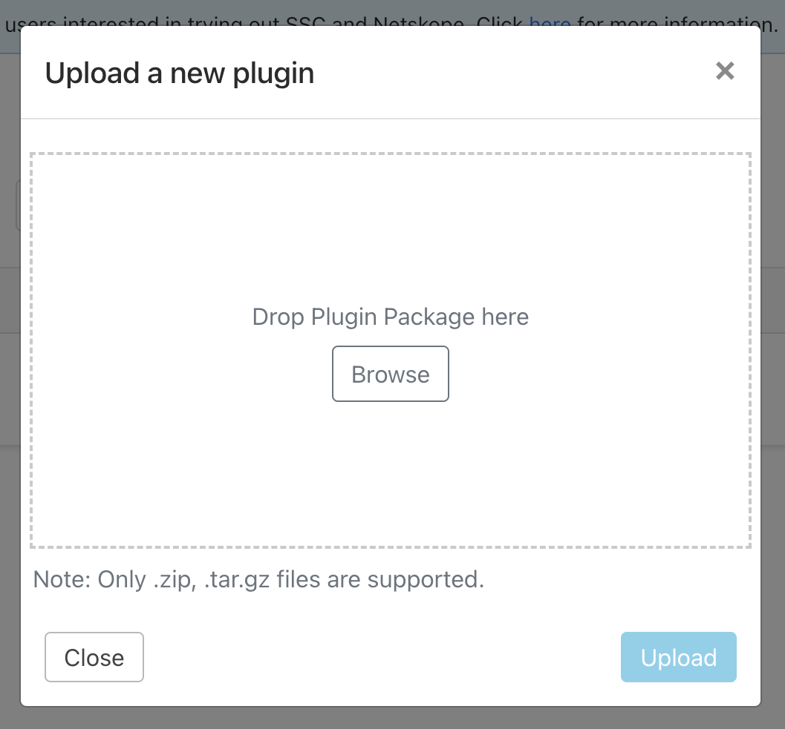
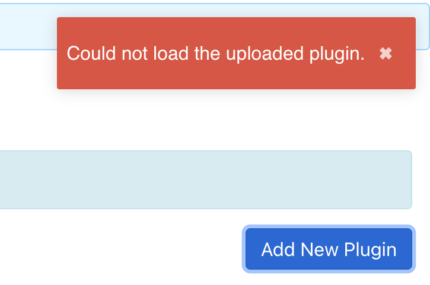
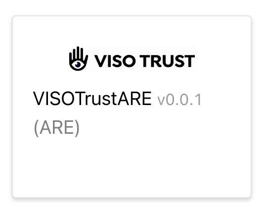
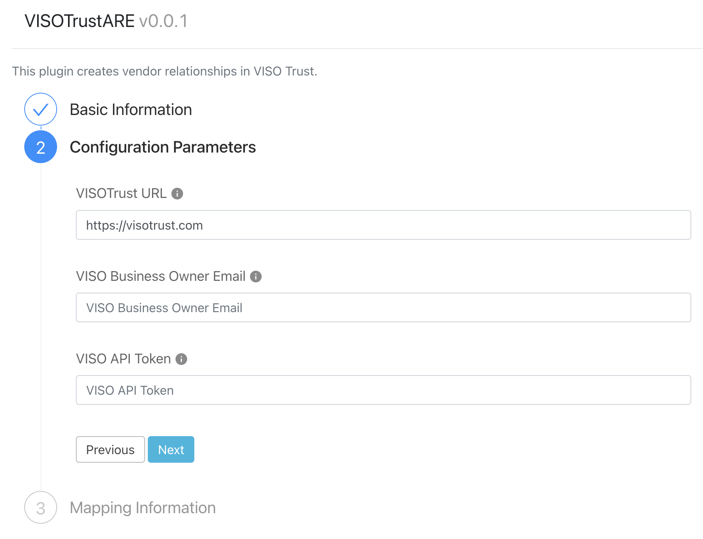
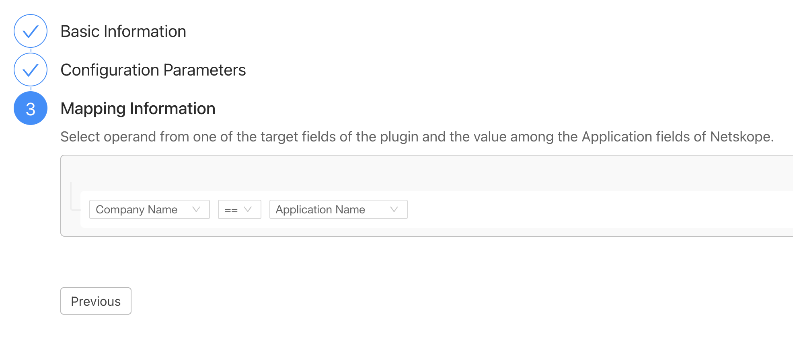

# VISOTrust Netskope Application Risk Exchange (ARE) Plugin

## Plugin Installation

The plugin is installed as a compressed package (`.tar.gz`). If you navigate
from the Admin UI to the plugins screen, and follow `Settings` -> `Plugins` in
the left navbar, there ought to be a screen with an `Add New Plugin` button
on the right:

Your mileage may vary, but the filter placed on the file selector created by the
"Open" button will filter out `.tar.gz` files &mdash; it's best to drag the
package file onto the drop point and then click "Upload".  Invariably you will
see a "Could not load..." error immediately after upload.

This message is spurious. Filter the visible plugins to the ARE-specific subset via the
"Category" dropdown, both to remove clutter and cause Netskope to-reevaluate the
set of live plugins.  If the plugin list has a VISO entry, we're in good shape.

Click on the plugin to configure.

## Plugin Configuration

The steps are as follows:
 1. Enter a unique name for the plugin configuration.
 2. Enter the VISO-specific configuration parameters.
 3. Enter a make-believe filter in order to mollify Netskope.

We'll skip step one.

### Step 2: VISO-Specific Config

The fields are self-explanatory. On clicking "Next", an `OPTIONS` request will
be sent to the VISO public API using the given credentials.

The final configuration
screen is a little confusing.  It appears _all_ ARE plugins are required to define
at least one mapping.  Whatever you select will have no influence on how the plugin
operates &mdash; just select the first item from both lists.
